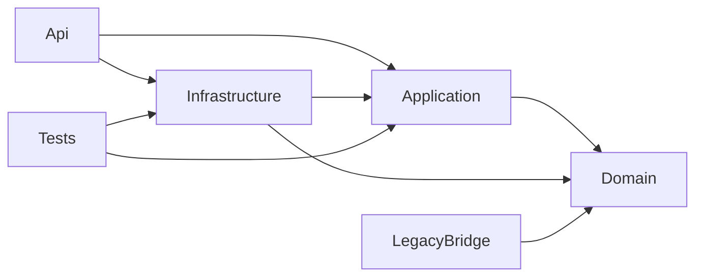
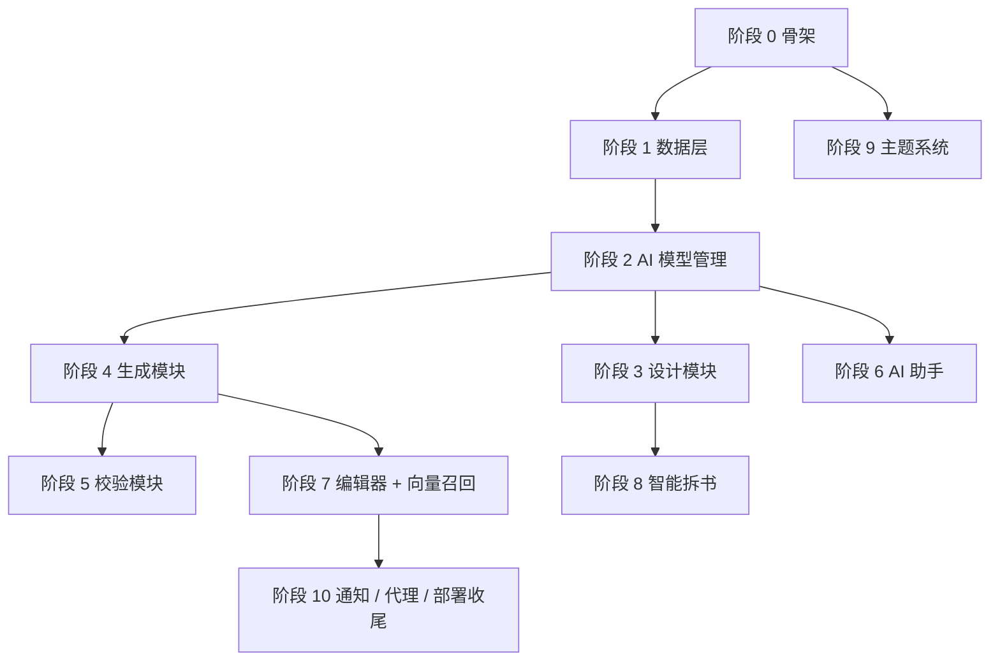

# 天命 Web 化迁移路线图

> **文档定位**：本文档是阶段 0 之后所有后续会话的**唯一不漂移契约**。每个独立会话只负责一个阶段，所有决策、范围、不做清单都以此为准。

## 一、项目背景

[根目录天命](../../README.md) 是一款 .NET 8 + WPF 桌面应用，用于按"五大规则 + 12 维事实快照 + 六道门禁"驱动 AI 生成网文。原项目规模：

- C# 代码：约 17.5 万行（761 个 .cs 文件）
- XAML：约 2.9 万行（155 个 .xaml 文件）
- 数据存储：全部 JSON 文件，无数据库

由于 WPF 只能跑 Windows，本次迁移目标是把它改造为浏览器访问的单用户 Web 应用，支持本地直接运行或 Docker 一键部署。

## 二、核心决策（不可漂移）

| 决策项 | 选定方案 | 理由 |
|--------|---------|------|
| 部署模式 | 单用户本地部署 / Docker 单镜像 | 不做多用户 SaaS，避免 JWT/计费/隔离等大量额外工作 |
| 后端 | ASP.NET Core 8 (net8.0) | 可通过 LegacyBridge 项目源码包含原 `Services/Framework/AI/` + `Services/Modules/ProjectData/`（约 8-10 万行业务代码）零修改复用 |
| 前端 | Vue 3.5 + TypeScript + Vite 6 + Pinia + Element Plus | 国内生态成熟，前后端分离 |
| 存储 | SQLite + EF Core 8 + 文件存储（章节 .md） | 部署简单、单文件备份 |
| AI 框架 | Microsoft Semantic Kernel 1.73 | 继续用，OpenAI Connector 跨平台 |
| 嵌入模型 | OpenAI 兼容 Embeddings API | 放弃本地 ONNX，减少镜像体积，避免架构差异 |
| 爬虫 | Microsoft.Playwright | 替代 WebView2（Windows 独占） |
| 流式推送 | SignalR + 注入式 `IGenerationNotifier` | 替代原静态 `GenerationProgressHub`，避免多连接串号 |
| 主题系统 | 完整迁移 21 色 + 17 主题 + AI 配色 + 图片取色 + 定时切换 | 保留原项目竞争力特性 |
| 通知 / 语音 | 浏览器 Web Notification API + Web Speech API | 替代 Windows Toast / System.Speech |
| 认证模式 | NoAuth 默认（仅 127.0.0.1）+ LocalPassword 可选 | 单用户场景不需要复杂权限体系 |

## 三、端口约定

| 用途 | 端口 |
|------|------|
| 后端 ASP.NET Core HTTP | 38721 |
| 前端 Vite Dev Server | 38720 |
| Docker 对外映射 | 38721 |

## 四、仓库结构

```
tianming-novel-ai-writer/         (原 WPF 工程,完全保留)
└── web/                          (本次新增,所有 Web 化工作都在这里)
    ├── README.md
    ├── backend/                  ASP.NET Core 8 Solution
    │   ├── src/
    │   │   ├── TM.Web.Api/             启动入口 + Controllers + Hubs + Middleware
    │   │   ├── TM.Web.Application/     用例 + DTO + 抽象服务 + AI 编排
    │   │   ├── TM.Web.Domain/          领域实体 + 仓储接口
    │   │   ├── TM.Web.Infrastructure/  EF Core + SQLite + Playwright + 文件存储
    │   │   └── TM.Web.LegacyBridge/    通过 <Compile Include> 源码包含原 Services
    │   └── tests/
    ├── frontend/                 Vue 3 + Vite SPA
    ├── docker/                   Dockerfile + docker-compose.yml
    └── docs/                     本文档与配套设计
```

## 五、依赖关系



LegacyBridge 与 Infrastructure 通过 Application 层的接口对接（如 `IGenerationNotifier`），保证依赖方向干净。

## 六、阶段路线图



### 阶段 0：骨架 + 端到端切片【本阶段已完成】
- **目标**：搭建可运行的前后端骨架，跑通 1 个 AI 流式 Demo
- **产出**：52 个文件（详见 [阶段0完成报告.md](阶段0完成报告.md)）
- **不做**：任何业务模块、SQLite schema、LegacyBridge 接入

### 阶段 1：数据层
- **目标**：EF Core schema + 数据导入工具
- **输入**：原 `Storage/` 下的全部 JSON 文件
- **产出**：
  - 50+ 张 SQLite 表（详见 [数据模型映射.md](数据模型映射.md)）
  - 一键导入工具 `dotnet TM.Web.Api.dll --import <path-to-old-storage>`
  - LegacyBridge 项目正式接入（通过 `<Compile Include="..\..\..\..\..\Services\**\*.cs">` 源码包含 [Services/Framework/AI/](../../Services/Framework/AI/) 与 [Services/Modules/ProjectData/](../../Services/Modules/ProjectData/) ）
  - 清理 [Services/Framework/SystemIntegration/TrayIconService.cs](../../Services/Framework/SystemIntegration/TrayIconService.cs) 等不可移植文件（用 `<Compile Remove>`）
  - `StoragePathHelper` 改造为可注入版本
- **不做**：Controller / API（数据层先就绪即可）

### 阶段 2：AI 模型管理
- **目标**：Provider / Model / API Key 完整 CRUD + 多 Key 轮换
- **API**：
  - `GET /api/ai-providers`
  - `POST /api/ai-providers/{id}/models`
  - `POST /api/ai-keys`
  - `POST /api/ai-keys/{id}/test`
- **前端**：`/settings/ai-models` 完整界面
- **不做**：聊天对话（阶段 6）、向量索引（阶段 7）

### 阶段 3：设计模块（五大规则）
- **范围**：世界观、角色、势力、地点、剧情、创作素材
- **API**：每个领域一组 CRUD + 树形分类 + 引用查询
- **前端**：`/design/*` 全部界面，左侧树 + 右侧编辑器布局
- **复用**：[Modules/Design/](../../Modules/Design/) 下的 Service 通过 LegacyBridge 接入

### 阶段 4：生成模块【正式范围已接入，待运行验证】
- **范围**：大纲、分卷、章节规划、章节蓝图、章节生成、生成门禁
- **核心**：复用 [Services/Modules/ProjectData/Implementations/Generation/GenerationGate.cs](../../Services/Modules/ProjectData/Implementations/Generation/GenerationGate.cs)（1309 行业务）
- **改造**：把原静态 `GenerationProgressHub.Report(string)` 改为通过 `IGenerationNotifier` 注入推送
- **前端**：`/generate/*` 完整界面
- **当前仓库状态**：已完成 `/generate/*` 工作台、章节草稿生成、`GenerationRecord` / `GenerationStatistics` 记录、`/generate/gate` 门禁交互页、完整 12 维事实快照输入、`ParsedChanges` 状态回写与有限多轮重写链路；当前环境后端 `dotnet build` 仍存在无输出卡住问题,阶段 4 需要在可用 MSBuild 环境中做最终运行验证

### 阶段 5：校验模块
- **范围**：统一校验 + 章节修复 + 12 维事实快照浏览
- **复用**：[Services/Modules/ProjectData/Implementations/Validation/](../../Services/Modules/ProjectData/Implementations/Validation/)

### 阶段 6：AI 助手
- **范围**：Agent / Plan / Edit 三种模式 + 思考链展示 + 对话记忆
- **复用**：[Services/Framework/AI/SemanticKernel/Conversation/](../../Services/Framework/AI/SemanticKernel/Conversation/) 整套
- **前端**：`/ai-assistant` 完整界面，支持流式思考块折叠

### 阶段 7：编辑器 + 向量召回
- **编辑器**：Monaco + Markdown 渲染 + 版本对比（diff2html）
- **向量召回**：
  - 实现 `OpenAITextEmbedder`（替代 `OnnxTextEmbedder`）
  - 在 `ITextEmbedder` 加 async + 批量方法
  - 索引存储：sqlite-vec 扩展 或 Kernel Memory `MemoryServerless`

### 阶段 8：智能拆书
- **替换**：[Modules/Design/SmartParsing/BookAnalysis/Crawler/WebCrawlerService.cs](../../Modules/Design/SmartParsing/BookAnalysis/Crawler/) 的 WebView2 → Microsoft.Playwright
- **Docker**：基础镜像切换为 `mcr.microsoft.com/playwright/dotnet:v1.49.0-noble`

### 阶段 9：主题系统
- **完整迁移**：
  - 21 个 CSS variable + 17 套主题数据（从 [BuiltInThemes.cs](../../Framework/Appearance/ThemeManagement/BuiltInThemes.cs) 转 JSON）
  - AI 配色（复用 [Framework/Appearance/IntelligentGeneration/AIColorScheme/](../../Framework/Appearance/IntelligentGeneration/AIColorScheme/) 算法）
  - 图片取色（Canvas + color-thief 替代 WriteableBitmap）
  - 定时切换 + 日出日落（suncalc 库 + 复用 [HolidayLibrary.cs](../../Framework/Appearance/AutoTheme/TimeBased/HolidayLibrary.cs)）
  - prefers-color-scheme 系统跟随

### 阶段 10：通知 + 代理 + 部署收尾
- **通知**：Web Notification API + Service Worker Push（PWA 可选）
- **语音**：Web Speech API（取代 [Framework/Notifications/Sound/VoiceBroadcast/](../../Framework/Notifications/Sound/VoiceBroadcast/) 的 System.Speech）
- **代理**：从 appsettings 读 HTTP/SOCKS 代理给 `IHttpClientFactory`
- **部署**：Docker 镜像优化 + Healthcheck 完善 + 文档完善
- **本地密码**（可选）：复用 [Framework/User/Security/PasswordProtection/](../../Framework/User/Security/PasswordProtection/) 的口令哈希逻辑做单密码本地登录

## 七、明确不做的事

- 多用户体系（注册/JWT/邮箱验证/密码找回）
- 在线协作 / 多人编辑
- 移动端 App（PWA 自适应即可）
- 自有云服务 / 计费 / 订阅
- 系统托盘 / 服务启动项
- Windows 强调色检测 / Aero 状态 / WMI 系统监控
- 系统音量控制（Web 端 API 无法做到）

## 八、关键技术债提示

阶段 1 接入 LegacyBridge 时必须处理：

1. **5 处 `GlobalToast.*` 调用**（在 [SKChatService.cs](../../Services/Framework/AI/SemanticKernel/SKChatService.cs) 等）→ 全部改为 `ILogger` 或包装层屏蔽
2. **静态 event `GenerationProgressHub`** → 用注入式 `IGenerationNotifier`（本阶段已实现）
3. **`StoragePathHelper` 硬编码路径** → 改造为可注入 + `Storage:RootPath` 配置
4. **`AIService` 的 API Key 明文 JSON 持久化** → 改为 SQLite + AES 加密（密钥派生自启动时生成的本地 master key）
5. **`MemoryServerless` 单进程向量库** → 阶段 7 评估是否换 sqlite-vec / Qdrant

---

> 最后更新：阶段 0 完成时落地
